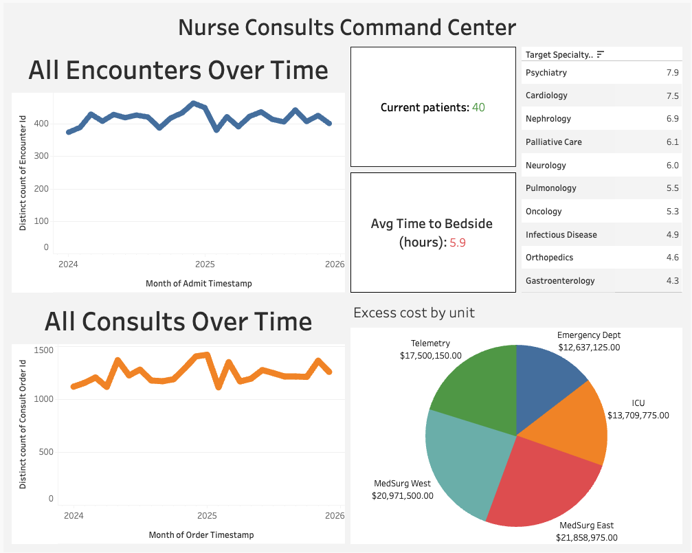

# Clinical Consult Communication Pipeline - Project Case Study

---

## The Problem

In hospitals, bedside nurses serve as the main communication channel between physicians and specialists. When a doctor orders a consult, say "have Cardiology evaluate this patient," the nurse is responsible for calling the specialist, often multiple times across channels like chat apps, and voice badges.

This creates a **bottleneck** that:
- Burns nurse time on communication tasks alone
- Delays specialist consults, increasing patient **Length of Stay**
- Contributes directly to **nurse burnout** 

Hospital leadership like Chief Nursing Officers lack visibility into this friction. They know consults are slow but can't pinpoint *why*, *where*, or *how much it costs*.

---

## The Solution

I built **Clinical Consult Communication Pipeline** 

1. **Generates** realistic synthetic hospital data simulating EHR and messaging platforms
2. **Processes** raw data through a PySpark ETL pipeline with feature engineering
3. **Analyzes** the data using DuckDB SQL queries answering 6 key business questions
4. **Visualizes** findings in a Tableau Public executive dashboard


---

## Key Findings

1. **Specialty Turnaround**: Cardiology and Psychiatry are the slowest specialties (Psychiatry: 7.9 hrs, Cardiology: 7.4 hrs avg bedside); Gastroenterology is the fastest (4.3 hrs).
2. **Channel Effectiveness**: Vocera Badge Call is the fastest communication channel (3.1 min avg response); Phone Call to Office is the slowest (40.3 min).
3. **Friction Correlation**: The number of nurse outreach messages per consult has no statistical significance on consult turnaround times.
4. **Temporal Analysis**: Weekend Night Shift is the slowest shift combination (7.7 hrs avg bedside) compared to Weekday Day Shift (5.0 hrs).
5. **Financial Impact**: Total estimated excess bed cost is $14.8M across all admitting units due to consult-related discharge delays.
6. **Specialist Performance**: Identified individual performance outliers by specialty (Dr. Cameron — 9.0 hrs to bedside).

---

## Dashboard Showcase

Access the live interactive dashboard here: [Nurse Consults Command Center](https://public.tableau.com/views/NurseConsultsCommandCenter/Dashboard1?:language=en-US&:sid=&:redirect=auth&:display_count=n&:origin=viz_share_link)



---

## Repository Structure

```
C3-Pipeline/
├── README.md                          # This file
├── requirements.txt                   # Python dependencies
├── .gitignore
│
├── notebooks/
│   ├── 01_data_generation.ipynb       # Synthetic data generator
│   ├── 02_pyspark_etl.ipynb           # PySpark ETL pipeline
│   └── 03_sql_analytics.ipynb         # DuckDB analytics with commentary
│
├── sql/
│   ├── 01_schema_creation.sql         # DDL for all 6 tables
│   ├── 02_consult_turnaround.sql      # Turnaround by specialty
│   ├── 03_channel_effectiveness.sql   # Channel response comparison
│   ├── 04_friction_analysis.sql       # Message count vs. delay
│   ├── 05_weekend_vs_weekday.sql      # Temporal analysis
│   ├── 06_excess_bed_day_cost.sql     # Financial impact
│   └── 07_specialist_leaderboard.sql  # Individual specialist ranking
│
├── data/
│   ├── raw/                           # Raw generated CSVs (gitignored)
│   ├── processed/                     # PySpark output (gitignored)
│   │   ├── parquet/
│   │   └── csv/
│   └── sample/                        # Small samples committed for demo
│
├── dashboard/
│   ├── data_tableau/                  # Processed CSVs for Tableau Public
│   ├── dashboard_ss.png               # Dashboard screenshot
│   ├── tableau_step_by_step.md        # Dashboard build guide
│   └── tableau_public_link.md         # Live dashboard link
│
└── docs/
    ├── data_dictionary.md             # Column-level documentation
```

---


## Data Schema

Full documentation: [Data Dictionary](docs/data_dictionary.md)

---
